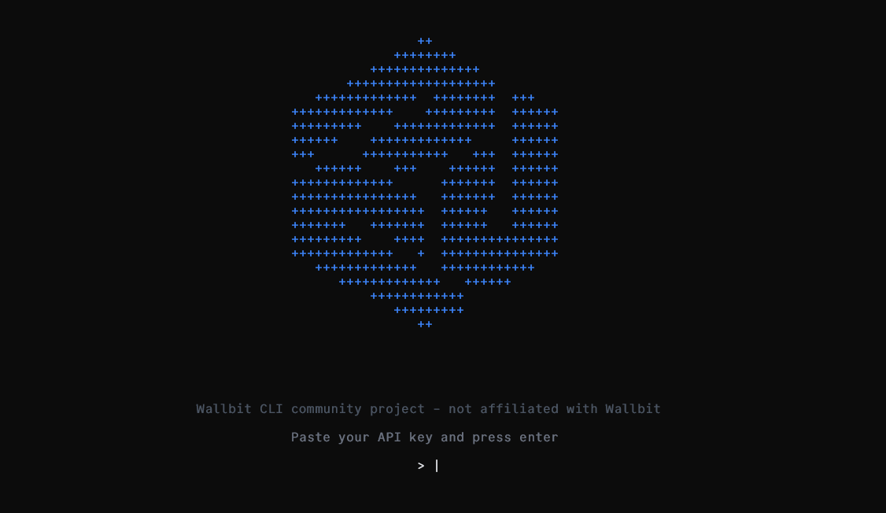
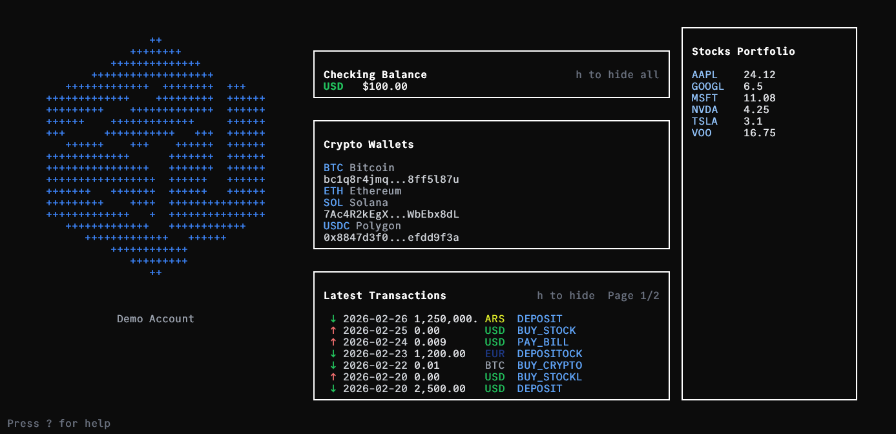
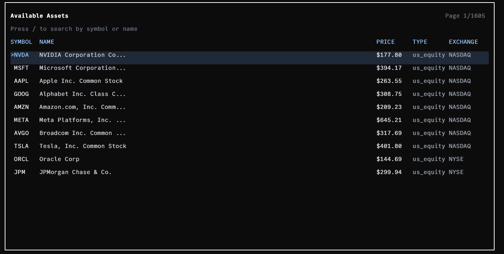
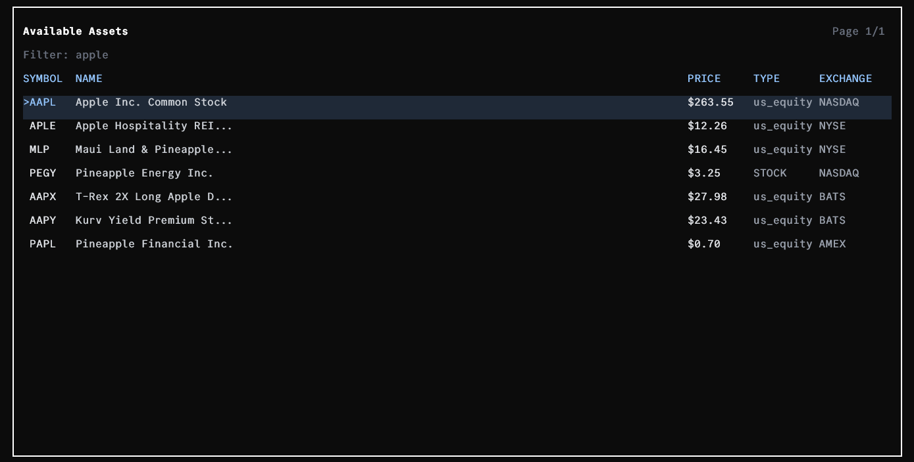
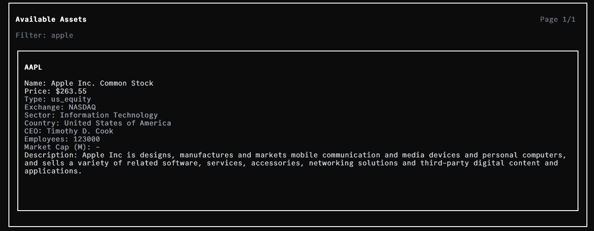

# Wallbit CLI Dashboard

Terminal dashboard for Wallbit.












## Requirements

- A Wallbit API key with `read` permission
- Optional: an OpenAI API key to enable the AI agent chat

## Security disclosure

The API keys you use are never stored on an external server or log in anyway. The Wallbit CLI will request the API key on startup everytime, and the optional AI provider token is stored in your OS Keychain / Secret manager.

### Keychain in macOS

https://support.apple.com/guide/keychain-access/what-is-keychain-access-kyca1083/mac

### About secret manager for Windows

https://grahamwatts.co.uk/windows-secrets/

- Never share terminal output containing environment variables.
- Never paste or commit API keys into code, screenshots, logs, or chat.

## Install

### macOS / Linux

```bash
curl -fsSL https://raw.githubusercontent.com/lucaspiritogit/wallbit-cli/main/install.sh | sh
```

### Windows (PowerShell)

```powershell
irm https://raw.githubusercontent.com/lucaspiritogit/wallbit-cli/main/install.ps1 | iex
```

After install, run:

```bash
wallbit-cli
```

## Development Requirements

- Bun installed (`bun --version`)

## Features

- Session-based masked API key login (no env var required)
- OpenAI key and AI provider preference stored in OS keychain (Windows Credential Manager, macOS Keychain, Linux Secret Service)
- Checking balance panel
- Crypto wallets panel
- Latest transactions panel with pagination
- Stocks portfolio side panel
- Interactive asset list
- Small AI chat to talk with the wallbit-cli agent and get customized insights or recommendations (experimental)
- Command bar to execute actions with `!` or ask a question to the agent using `?`

## Setup

1. Install dependencies:

```bash
bun install
```

## Run

```bash
bun run start
```

For development with file watching:

```bash
bun run dev
```

On each new session, the app shows a masked API key input screen. Paste your Wallbit API key there and press `enter`.

## Keyboard shortcuts

- `h`: hide/show all currency values (balances + transactions)
- `left` / `right`: previous/next transactions page
- `w`: open wallets modal (copy wallet addresses)
- `up` / `down` + `c` or `enter` (inside wallets modal): select and copy address
- `esc` or `ctrl+c` or `q`: quit
- `:` focus command bar to start typing
- `ctrl+j` open chat agent window

## Disclaimer

- This is a community project and is not affiliated with Wallbit.
